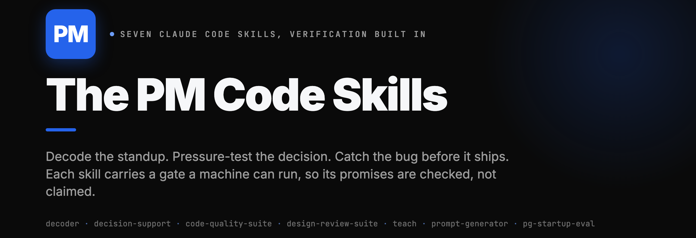

<div align="center">



# The PM Code Skills

**Seven Claude Code skills for people who ship products, not templates.**

Each one solves a moment that kept going wrong in real product work: a standup you did not follow, an idea nobody stress-tested, a branch that shipped a bug, a screen that looked off and no one could say why. Every skill carries a verification section a machine can run, so its promises are checked, not claimed.


*A collection by [The PM Code](https://www.linkedin.com/company/the-pm-code/). Follow along as we build in public.*

</div>

---

## What this is

A Claude Code skill is a folder of instructions that Claude reads and follows the moment your request matches it. No setup, no key, no service. You drop the folder into `~/.claude/skills/` and the skill activates on its own when you need it.

These seven were built the hard way. Each started as a workflow that broke in the same place every week, got written down as a contract, then got a verification gate bolted to the bottom so it could not quietly drift. Two of them fold in outside reference material, credited in [NOTICE.md](NOTICE.md); the mode logic, the finding formats, and the gates are original work.

## The skills

| Skill | The moment it fixes | Verdict it forces |
|---|---|---|
| **[decoder](skills/decoder/)** | Your engineer said something in the standup and you nodded without understanding it | The concept, an analogy, the trap, and one question to bring back |
| **[decision-support](skills/decision-support/)** | An idea, plan, or decision needs pressure before anyone commits | A forced verdict with a kill criterion, or a plan with every open branch named |
| **[code-quality-suite](skills/code-quality-suite/)** | A branch is about to ship and you want the bugs found first | Ranked findings, each with a reproduction and a named test |
| **[design-review-suite](skills/design-review-suite/)** | A screen looks off and nobody can say which rule it breaks | Every finding cites WCAG 2.2 or a Nielsen heuristic, or it is labelled TASTE and ranked below |
| **[teach](skills/teach/)** | Real work produced a lesson worth keeping, and it vanished by the next session | One six-line lesson, logged and seeded into spaced repetition |
| **[prompt-generator](skills/prompt-generator-skill/)** | A vague prompt makes the model guess tone, structure, and format | A production-ready XML prompt, about 75 percent fewer tokens than the naive version |
| **[pg-startup-eval](skills/pg-startup-eval/)** | AI feedback on your startup idea is encouraging mush | Seventeen investor frameworks and a Strong, Weak, or Pivot verdict |

## What makes them different

Most skills you find are a paragraph of good intentions. These are contracts.

**A mode is named before it runs.** decision-support tells you it is in GRILL mode before the first question. code-quality-suite states SECURITY or PRE-LAUNCH before it reads a line. You always know which job is running.

**Every claim carries a source.** A finding names a file and a line, or a rule, or the command that produced the number. code-quality-suite will not return a passing verdict without pasted test output. design-review-suite deletes any row whose measured value was estimated rather than computed. A claim with no source gets a label that ranks it last.

**The gate is mechanical.** decoder is graded by an adversarial eval suite of 33 fixtures, each built to make it fail in one specific way, each answer judged by a second model told to refute it rather than agree. That is the bar the whole collection is held to: a promise you cannot measure does not ship.

**They degrade honestly.** Each skill has a private local-context layer that is not published here. When that layer is absent, the skill still runs end to end and says exactly what it skipped. It never invents a path, a name, or a count to look complete.

## Install

Every skill installs the same way. Clone the repository, then copy the one skill you want into your Claude Code skills folder.

```bash
git clone https://github.com/Anmoll-W/thepmcode-skills
cp -r thepmcode-skills/skills/decoder ~/.claude/skills/decoder
```

Swap `decoder` for any skill folder name from the table above. Want all of them?

```bash
git clone https://github.com/Anmoll-W/thepmcode-skills
cp -r thepmcode-skills/skills/* ~/.claude/skills/
```

Once a skill sits in `~/.claude/skills/`, it activates automatically inside Claude Code the moment your request matches what it does. Each skill folder has its own README with the details.

## A closer look at each

### decoder

You are in the standup. Your engineer says you need a message queue because the webhook processing is causing race conditions. You nod, you write it down, and two days later you realise you approved something you did not understand. decoder reads what you pasted, works out whether you want an explanation, an approval call, or a safety read, and answers first, always, before it asks you anything. Every answer ends by telling you whether it checked your system or gave you general principle, because a confident guess and a researched answer read identically until the tool is forced to say which one you are holding. [Read more](skills/decoder/).

### decision-support

Four modes for the moment before you commit. EVALUATE judges an idea to a forced verdict with a kill criterion. GRILL interviews you one question at a time on a plan you will defend, and every "we will figure that out later" goes on the open list by name. INVERT runs a proposed solution back to the problem it claims to solve, and grades the evidence twice, because a single grade hides the gap between a real pain and an untested fix. CHALLENGE red-teams a position you are not defending live. [Read more](skills/decision-support/).

### code-quality-suite

Five review modes over one shared baseline. FIND-BUGS reads every changed file end to end and maps the failure surface. SECURITY scopes it to the OWASP Top 10 at an ASVS Level 1 bar and traces every tainted value to its source before it reports. QA-CHECKLIST builds a test plan from the code, never from memory. WEBAPP-TEST drives a running app with Playwright. PRE-LAUNCH audits a whole repository with six specialists and a mandatory independent verification pass, so no specialist is the last word on its own claim. [Read more](skills/code-quality-suite/).

### design-review-suite

Five modes that turn "this looks off" into a finding with a rule number. CRITIQUE scores the Nielsen heuristics against named elements. AUDIT measures contrast, target size, and font stacks into a table where every value came from a command. POLISH runs the last pass over spacing, state, type, and motion, and gates itself on BUILD-CHECK. BUILD-CHECK reads a fifteen-line checklist by command and prints one verdict. DESIGN-SYSTEM picks palettes and pairings and runs them through the contrast probe before any code uses them. [Read more](skills/design-review-suite/).

### teach

One session, one lesson, six lines. When real work produces something worth keeping, an architectural decision, a product judgment call, a pattern applied, teach writes a six-line block, logs the concept, and seeds it into a spaced-repetition queue due tomorrow. The review mode quizzes you on what you actually built, not on definitions, and it deletes any card that points at infrastructure you have since retired. It is small on purpose. A lesson that costs the session its flow is not read twice. [Read more](skills/teach/).

### prompt-generator

A vague prompt forces the model to make dozens of implicit decisions about tone, structure, depth, and format, and every one of those is variance and wasted tokens. This skill turns a role description into a production-ready, XML-structured prompt with a consistent eight-section schema, cutting roughly 75 percent of the tokens a naive prompt burns on preamble, trailing summaries, and prose where a table would do. [Read more](skills/prompt-generator-skill/).

### pg-startup-eval

Most AI feedback on a startup idea is encouraging mush with no framework and no verdict. This skill runs any idea through seventeen investor and founder frameworks, from Paul Graham and Thiel to Sequoia and the Mom Test, pulls live market research, sizes the market bottom up, and ends with one verdict that does not hedge: Strong, Weak, or Pivot Required, with the three fatal flaws named. [Read more](skills/pg-startup-eval/).

## License and credit

The original work here is MIT licensed. See [LICENSE](LICENSE).

Two skills bundle third-party reference material that keeps its own license: code-quality-suite reads OWASP Cheat Sheet content (CC BY-SA 4.0) and an Apache-2.0 Playwright reference, and design-review-suite reads the MIT-licensed ui-ux-pro-max database and the MIT-licensed Vercel Labs web interface guidelines. Full attribution is in [NOTICE.md](NOTICE.md) and in each skill's own NOTICE.

## Let us connect

Built by [The PM Code](https://www.linkedin.com/company/the-pm-code/) · [Newsletter](https://thepmcode.substack.com) · [thepmcode.com](https://thepmcode.com)

If a skill saved you a bad meeting or a shipped bug, a star helps other product people find it.
