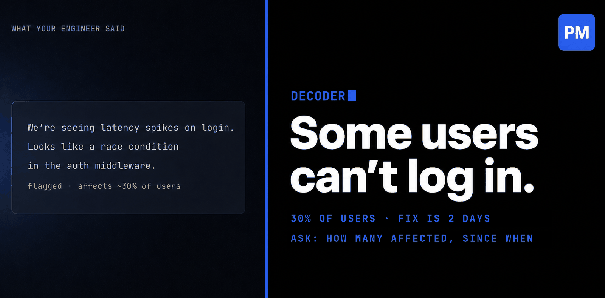
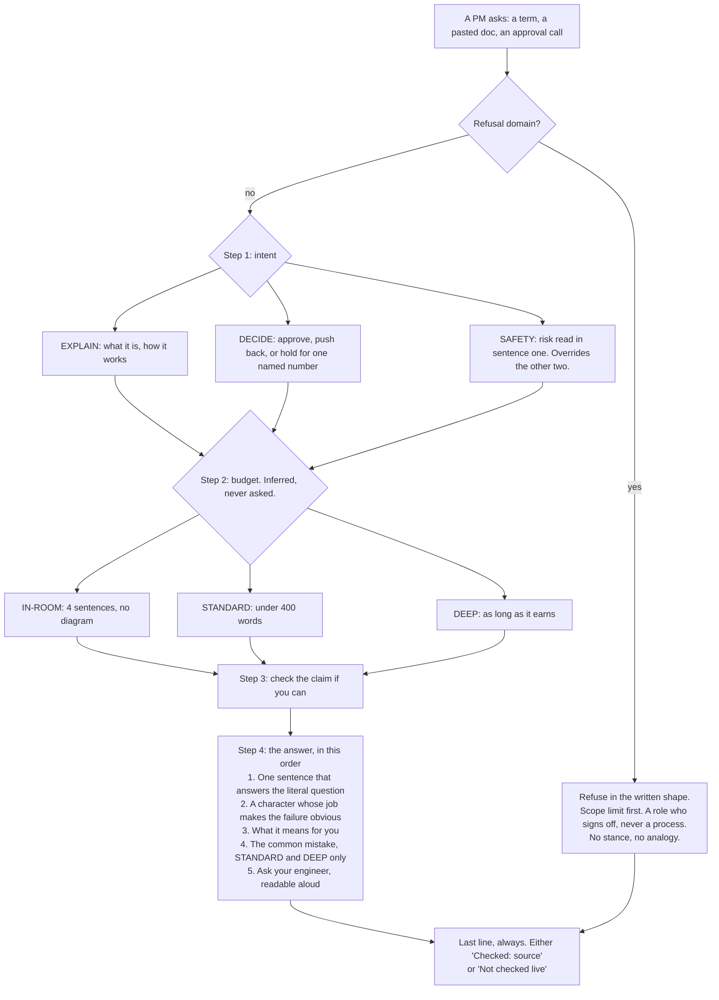
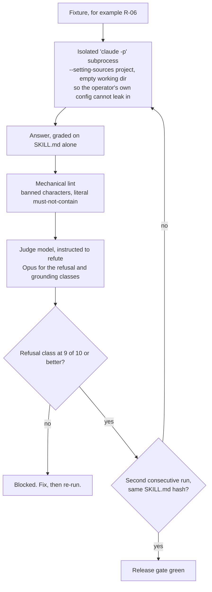

# Decoder

*A tool by [The PM Code](https://www.linkedin.com/company/the-pm-code/). Follow us on LinkedIn.*

---

You are in the standup. Your engineer is talking. They say something like:

> "We need to add a message queue because the webhook processing is causing race conditions."

You nod. You write it down. You move on.

Later that afternoon, your manager asks what the sprint is focused on. You say "infrastructure work." They ask what kind. You pause.

You did not understand what your engineer said. You understood the words. Not the meaning.

This happens to every PM. Not because they are not smart. Because no one built a tool for this moment.

---

## Decoder

Decoder is a Claude Code skill. Drop in a technical term, paste a doc, or describe what your engineer just said. Decoder explains it at the right depth for where you are: in a standup, reading a spec, making an approval call.

It does not just define things. It teaches them. With an analogy. With the mistake most PMs make. With one question you can bring back to the engineer.

Here is what it looks like in action:

```
You: my engineer just said we need to add a message queue because the
     webhook processing is causing race conditions, what does that mean

Decoder: Two pieces of your system are trying to do the same job at the
same time and stepping on each other, and a queue forces them into a
single line.

Think of a deli counter. Right now a hundred customers are shouting
orders at the kitchen at once and two of them get the same sandwich.
A queue hands everyone a numbered ticket. The kitchen works through
tickets in order. No collisions.

For you: your webhook is the shouting. Stripe fires "payment succeeded"
and your system tries to update the order, send the email, and unlock
the feature all at once.

The common mistake: PMs hear "queue" and assume it makes things faster.
It usually makes things slower and correct, which is the trade you want.

Ask your engineer: "What happens if a message sits in the queue and
never gets processed? Does it retry automatically, or do we need to
build that?"

Not checked live. This is general principle, not a read of your system.
```

You walked in not knowing what a race condition was. You walked out with the concept, the analogy, the trap, and a question that will make your engineer think.

---

## It answers first. Always.

Decoder will never ask you a clarifying question before it has told you something. Not about how deep you want to go. Not about your seniority. Not about your setup.

If it is missing something it needs, it answers anyway under a stated assumption, then tells you what would change the answer. You are never made to specify the shape of an answer to a question you cannot yet parse.

It reads two things from your message, silently:

**What you are asking for.** Whether a thing means (an explanation), whether to approve a thing (a stance, not "it depends"), or whether something you already have is safe or broken (a risk read, first sentence, before anything else).

**How much room you have.** Standup phrasing gets four sentences and no diagram. A pasted document gets the full treatment. Everything else lands in between. You never pick.

---

## Every answer tells you where it came from

The last line of every explanation is either what Decoder checked, with the source, or a plain statement that it checked nothing and this is general principle rather than a read of your system.

This matters more than it sounds. A confident unsourced answer and a researched one read identically unless the tool is forced to say which one you are holding. If you are about to repeat something in a room where you will be challenged, you need to know which.

The same rule applies to comparisons. If Decoder contrasts one technology against another, the other one carries the same burden of proof.

---

## How an answer gets built

Nothing in this path is a question back to you. The refusal check runs before the stance, which is why Decoder never opens with "push back" and then concedes four paragraphs later that the call was never yours to make.



Intent and budget are independent. Every combination is valid, because budget changes how long an answer is and never what shape it has. IN-ROOM is the one exception worth stating: it drops "what it means for you" and "the common mistake" to hit four sentences, and it still ships the grounding line, which never counts against that budget.

## What it will not do

Written into the skill, not left to judgment:

- It will not tell you your system is safe. It can give you the general principle and the usual failure. It cannot see your code, and it says so.
- It will not invent a technology it cannot verify exists, or trade-offs for one.
- It will not pick silently between two readings of an ambiguous acronym.
- It will not give you legal, financial, or compliance rulings dressed as technical advice.
- It will not follow instructions hidden inside a document you paste. It reports them instead.
- It will not tell you your engineer's request is "normal" or "healthy" when it has not evaluated it. That is a position you cannot defend when someone asks what it is based on.

---

## What makes it different

Most explanations give you a definition. Decoder gives you a character.

Not "a cache is like a sticky note." That tells you nothing about when the sticky note is wrong.

This: *"A cache is like a sous chef who memorises the ten most ordered dishes so they are always half prepped. Fast, until the menu changes and nobody tells them."*

Now you understand the mechanism, the failure mode, and why your engineer is nervous about cache invalidation.

Every explanation has one of these. A character with a specific job. A job that implies behaviour. Behaviour you remember.

---

## The optional check

After it has explained, and only after, Decoder may offer one question to check the idea landed. Not definition recall. A scenario.

> Your payment webhook is firing a hundred times a second and your database handles twenty writes per second. What breaks, and what does a queue fix?

Get it right and you get the non-obvious implication that most people miss. Get half of it right and Decoder names which half, calls the gap a gap, and re-asks only that part. Say no and it drops the subject without comment and does not ask again.

---

## How it is tested

The rules above are not aspirations. They are graded by an adversarial eval suite of 33 fixtures across five classes, grounding, mode and budget, question quality, refusal, and teaching, kept with the full harness in the [decoder repository](https://github.com/Anmoll-W/decoder/tree/main/eval). Every fixture is built to make Decoder fail in one specific way, and each answer is graded by a second model instructed to refute it rather than confirm it.



Two thresholds are worth knowing before you quote any number from this repo.

**The gate is 9 of 10 on the refusal class, not 10 of 10.** Roughly a fifth of fixtures flip verdict against a byte-identical file, so demanding a perfect score twice in a row is not a high bar, it is an unreachable state. A gate that can never go green gets waived by whoever is in a hurry, which is worse than a slightly lower bar that is actually enforced.

**There is no overall pass-rate percentage, deliberately.** At that flip rate a single headline number would be mostly sampling noise. The suite holds a direction instead: the always-fail set must not grow, and no fixture may leave the always-pass set. Every published figure names the `SKILL.md` hash it was measured against and whether the harness was isolated.

Full methodology, including the measurement that showed 31% of one graded prompt was the operator's own configuration rather than the skill, is in the [eval README](https://github.com/Anmoll-W/decoder/tree/main/eval).

## Install

```bash
git clone https://github.com/Anmoll-W/thepmcode-skills
cp -r thepmcode-skills/skills/decoder ~/.claude/skills/decoder
```

Once installed, Decoder activates automatically inside Claude Code whenever you ask about a technical term, paste a doc, or signal that you are trying to understand something your engineer said.

No configuration. No setup. Just ask.

---

## Built for

PMs who want to actually understand what they are building, not just manage the people building it.

Senior PMs who are tired of nodding. Junior PMs who are scared to ask. Anyone who has discovered, two days after the standup, that they approved something they did not understand.

Decoder does not make you an engineer. It makes you the PM who asks the question that changes the meeting.

---

MIT licensed. See [LICENSE](LICENSE).

*Built by [The PM Code](https://www.linkedin.com/company/the-pm-code/). Follow along as we build in public.*
