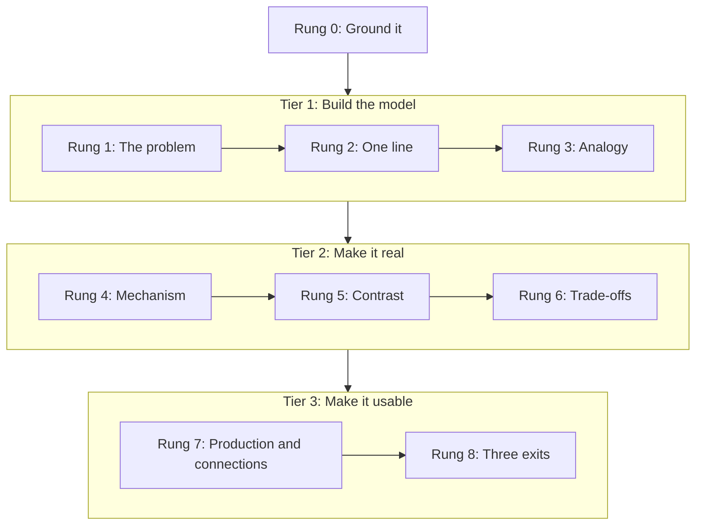
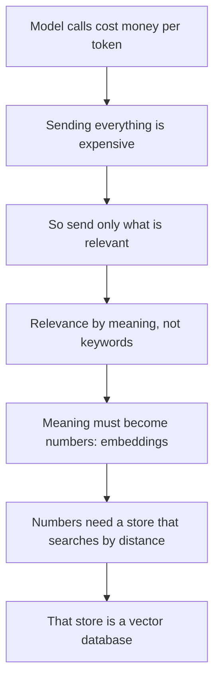
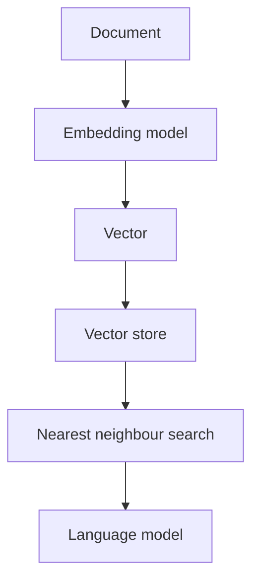
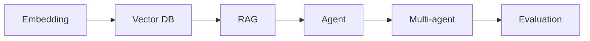

# The Explanation Ladder

**Doc type:** Reference.
**Audience:** every agent that explains anything to the reader. `references/local-context.md` names the sibling agents that share this contract on this machine; without that file, the audience is this skill alone.

**The rule in one sentence:** build the mental model first, then attach the vocabulary to it, and never state a mechanism you have not grounded.

This is the canonical explanation contract. This skill runs the full ladder. A sibling agent runs the short form inline. Both read this file; neither keeps its own copy. The short form's canonical shape is named in `references/local-context.md` when that file is present.

## Where it came from

Extracted 2026-08-01 from a ChatGPT teaching session the reader flagged as the best explanation received, verified against the transcript rather than against the model's own description of its method. Seven of the nine layers it claimed were observed in its actual output. Two were aspirational. Three of its strongest moves were not in its list at all, and they are Rungs 0, 5, and 8 below.

**Provenance limit, stated because this file mandates grounding.** Those four counts are not reproducible from any archive. The source was a transcript pasted into the 2026-08-01 session plus a share link (`chatgpt.com/share/6a6d7c78-6350-83e8-b618-73234fd876d5`), and neither was archived, so nothing here cites `file:line`. Treat the counts as a session-time reading of a transcript that is no longer in reach, not as a checkable fact. The rungs themselves stand on their own reasoning and do not depend on the counts being right. Rung 0 is not from the source at all; it was added because every other rung increases persuasion.

---

## The ladder

Climb in order. The order is the technique: every rung is only understandable because of the one below it. Skipping to Rung 4 produces a definition, which is the failure mode this ladder exists to kill.

---

### Rung 0: Ground it

Before writing a single mechanism claim, know where it comes from. This rung is not part of the teaching. It is the thing that makes the teaching trustworthy.

| What you are explaining | Required grounding |
|---|---|
| Code or config in a repository you can open | A file read this session. Cite `file:line`. |
| An external system, framework, or version behaviour | A live search or docs lookup this session (decoder Phase 0). |
| A general principle with no version surface | Training knowledge is acceptable. |

If a claim cannot be grounded and is not a general principle: say "I am not certain of the mechanism here" and name what you would check. Never fill the gap with plausible-sounding architecture.

**Why this rung is first:** a fluent, well-analogised, completely wrong explanation is the worst possible output, because the ladder makes it *more* convincing. Every technique below increases persuasion. Rung 0 is what earns the right to use them.

---

### Rung 1: The problem

Open with what breaks without this thing. Not what it is.

> Why a vector database? Because sending one thousand PDFs to a language model is impossible.

The strongest version is a causal chain, where each step forces the next:

Now the definition is inevitable rather than memorised. Whoever climbs that chain can rebuild the concept from scratch a year later.

---

### Rung 2: One line

Compress it to a sentence that survives a week. Deliver it immediately after the problem, before any jargon.

| Concept | One line |
|---|---|
| API | You ask for information. |
| Webhook | I will tell you when something happens. |
| OAuth | Borrow someone else's data without knowing their password. |
| Embedding | Meaning converted into numbers. |
| Vector database | Search, but by meaning instead of keywords. |
| Agent | A model that can think, act, observe, and repeat. |

Test: if the reader remembers only this line, do they still hold the essence? If not, the line is a definition, not a compression. Rewrite it.

---

### Rung 3: Analogy

A character with a specific job, where the job implies the behaviour. Structure is forgettable; behaviour is not.

Weak: "A cache is like a sticky note."
Strong: "A cache is a sous chef who memorises the ten most-ordered dishes so they are always half-prepped: blazing fast until the menu changes and nobody tells them."

The second one carries the invalidation problem for free. That is the whole point.

Full bank: `analogies.md`. Prefer a fresh analogy over a recycled one.

---

### Rung 4: Mechanism

How it actually works, as a flow of components. Do not list parts; show the path a request takes through them.

Once the flow is visible, the vocabulary attaches to positions in it rather than to a glossary. Use Mermaid. Never use arrow characters in prose.

---

### Rung 5: Contrast

**This is the highest-leverage rung and the most commonly skipped.** In the source transcript, nearly every section was a pair rather than a description: old models against new, MongoDB against ClickHouse, managed against self-hosted, automation against native product.

Explain the thing against its sibling or its predecessor. A single-subject description is the weakest form of explanation available, because it gives the reader no boundary.

Two formats, both verified as effective:

**Paired characters.** MongoDB is the supermarket cashier: one customer, fast, done. ClickHouse is the regional manager: months of sales, aggregated, slow but total. Different jobs, so different systems.

**Two-column table** at the end, collapsing the whole explanation:

| Area | Older approach | Modern approach |
|---|---|---|
| Reasoning | Basic | Multi-step |
| Tool use | Rare | Native |

When there is no natural sibling, contrast against the naive version: what would you build if you had never heard of this, and what breaks?

---

### Rung 6: Trade-offs

What you give up. Be specific enough to be actionable, and always name the case where the recommended choice is wrong.

> Managed vector database: no infrastructure, faster delivery, automatic scaling. Against that: vendor dependency, and it cannot serve a client whose policy says customer data never leaves their own network. That client needs a self-hostable option instead.

The second half is the valuable half. An explanation that only lists benefits is marketing.

---

### Rung 7: Production and connections

Two short moves, one paragraph each.

**Where this runs for real.** Name the actual use and the constraint that bites. Data residency is abstract until it is banks, government, healthcare, and defence. OAuth is abstract until it is "Sign in with Google", GitHub integrations, and Slack apps.

**What it connects to.** Link the concept backwards to something already learned and forwards to what it enables. Isolated concepts decay; connected ones compound.

Explicit phrasing works: "This is the same principle as the caching we discussed, except the invalidation is manual."

---

### Rung 8: Three exits

The source transcript closed with three distinct artifacts, not one. Each serves a different use. Include all three on a full explanation.

1. **Key takeaways.** Three or four compressed statements. What survives if everything else is forgotten.
2. **Questions you could ask.** Three to five specific, open-ended questions that would land in a real room with an engineer or an interviewer. These prove comprehension better than any quiz.
3. **The sixty-second answer.** The whole concept, spoken, in sixty seconds. Compression forces the ideas to crystallise: if it cannot be said briefly, it is not yet understood.

Exit 2 is the one readers use most. Make the questions specific to the actual system under discussion, never generic.

---

## Depth selection

Never run all nine rungs on a small question. That is its own failure mode.

| Situation | Rungs |
|---|---|
| Inline explanation during other work | 0, 1, 2, 5, and 6 if a choice was made. Add 3 only if the concept is new to the reader |
| Quick question, two-minute answer | 0, 1, 2, 3, 4 |
| Full breakdown, learning session | All rungs |
| Decision support, approve or push back | 0, 1, 5, 6, and a committed stance |

Rung 0 is never optional at any depth. **Rung 5 is not optional on the inline row either**, corrected 2026-08-01: that row previously listed analogy and omitted contrast, which inverted the two rungs' actual value. A 2026-08-01 simulation measured contrast as one of only two moves this duty reliably produces, while analogy is padding on a code review or a design rationale, where the mechanism sentence is already the explanation. The canonical inline shape now reads `One line / Because / Versus / Flow / Costs`, with `Like` as the conditional sixth; `references/local-context.md` names where that shape is kept on this machine.

**Grounding applies to the comparator.** A claim about the sibling you contrast against is a mechanism claim and carries the same Rung 0 requirement as the subject. Mandatory contrast plus an unchecked comparator is a fabrication engine wearing a compliance badge. If the sibling cannot be grounded, contrast against the naive version instead: that is always groundable, because you are describing the thing you did not build.

---

## Voice rules that govern every rung

- Short sentences. One idea per sentence. No paragraph longer than four lines.
- No unexplained vocabulary. If the reader did not use the word, define it before using it.
- No em dashes and no arrow characters in any output. Use colons, commas, or Mermaid.
- Rungs never repeat each other. Each one adds something the previous did not contain.
- Have a point of view. No "it depends" without an immediate answer.
- Never make the reader feel slow for asking. "What even is an API" earns the same energy as a distributed systems question.
- **Rung numbers are internal scaffolding. Never print them.** Do not write "Rung 0:" or "climbing to Rung 4" in anything the reader sees. They asked to be taught, not to be shown the lesson plan. Observed failing in the 2026-08-01 simulation: an agent labelled a mechanism walkthrough "Rung 0", which is grounding, so the label was both visible and wrong. A rung you can name but misnumber is a rung you were decorating with, not climbing.
- **The ladder is a budget, not a checklist.** Climbing every rung on a small question is the failure mode the depth table exists to prevent. If the explanation is longer than the work it explains, cut rungs, starting from the bottom of the depth row you picked.

Full before-and-after examples: `voice-guide.md`.

## What this ladder does not own

Two formats sit next to the ladder and are frequently confused with it. Both were mis-merged in the 2026-08-01 simulation, so the boundary is stated here rather than left to judgment. Neither ships with this skill; both are named in `references/local-context.md` when it is present, and when it is absent this section simply does not apply.

| Format | Owner | Rule |
|---|---|---|
| The `💡 LEARN` block | the learning-injection skill, named in `references/local-context.md` | Fixed five lines after the header. The ladder does not restructure it, does not add rungs to it, and does not replace its `Connects to:` line with a contrast section. If a session produces both, the ladder shapes the explanation and the teach skill shapes the block. |
| The sign-off gate block | the gate contract named in `references/local-context.md` | Always the literal last block. No rung, exit, or teach-back may follow it. |

The ladder governs the prose between those two things. Nothing else.

## Glossary

- **Rung:** one step of this ladder.
- **Grounding:** the source that supports a mechanism claim, checked in the current session.
- **Contrast:** explaining a thing against its sibling or predecessor rather than in isolation.
- **Exit:** a closing artifact the reader takes away and uses.

<!-- Changelog:
2026-08-01 created. Extracted from a ChatGPT teaching session and verified against the transcript; two claimed layers dropped as unobserved, three unclaimed moves added as Rungs 0, 5, 8.
2026-08-01 hardened after a 7-agent simulation (3 personas, treatment vs control vs pre-change baseline). Three defects fixed: rung numbers were being printed to the reader and misnumbered, the inline shape was being merged into the teach skill's LEARN block, and no rule capped total length. Added the scaffolding rule, the budget rule, and the ownership boundary table.
2026-08-28 portability split: reader name, sibling agent names and vault paths moved to references/local-context.md; no rung, table, or voice rule changed. -->
